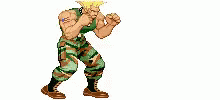

# Cornbread Stats

*cornbread! cornbread! cornbread!*

This is a rails api to collect and display CFN (Capcom Fighter Network) statistics for Street Fighter 6.

Currently in development, the api is very unstable.
